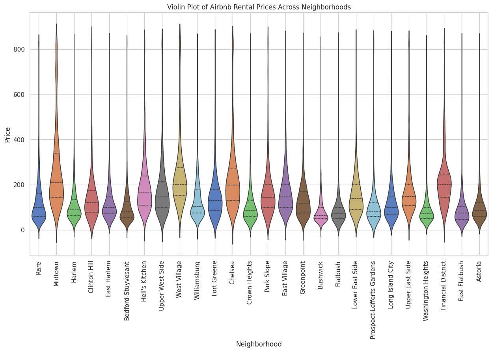
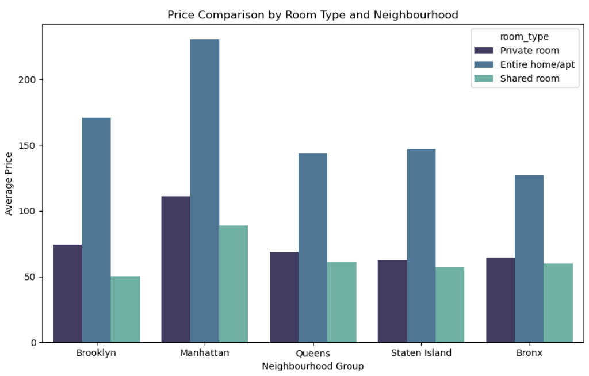
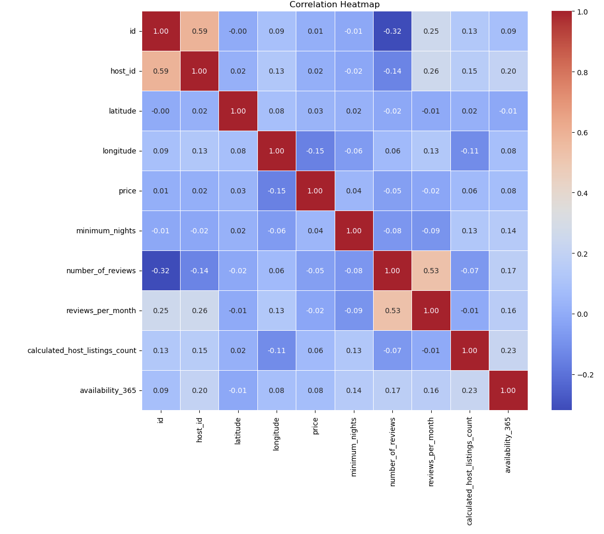
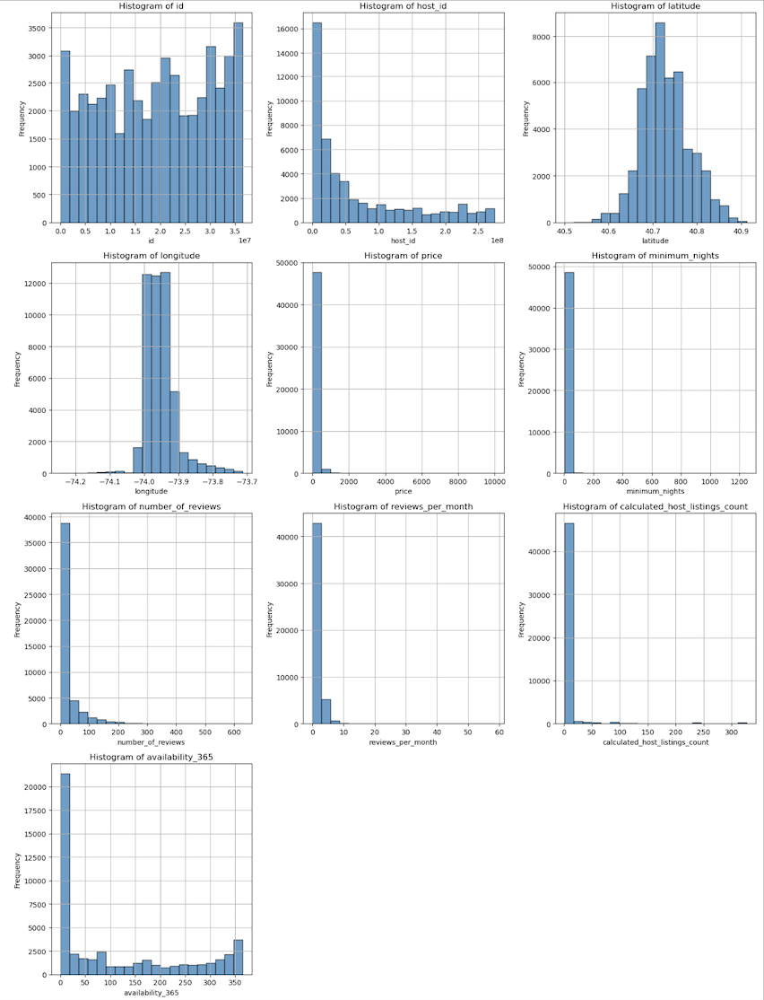

# Final Report: Airbnb Pricing Prediction Project

## How to Build and Run the Code

#### Step 1: Verify Dataset Location
Ensure that the dataset files are correctly placed under the following directories:
- **Raw Data**: `data/raw/AB_NYC_2019.csv`
- **Processed Data**:
  - `data/processed/cleaned_data_train.csv` (for training)
  - `data/processed/cleaned_data_test.csv` (for testing)
  - `data/processed/merged_data.csv` (for visualization)

#### Step 2: Install Dependencies
Create a virtual environment and install dependencies:
   ```bash
   make install
   ```
#### Step 3: Process Data (Optional)
If you want to reprocess the raw data and generate new cleaned data files:
   ```bash
   make data
   ```
#### Step 4: Run the Model
To run the model:
   ```bash
   make run
   ```
#### Step 5: Run Tests (Optional)
To ensure the code and data are functioning correctly:
   ```bash
   make test
   ```

---

## Description

This project aims to optimize rental price prediction using Airbnb Open Data. By leveraging advanced machine learning techniques, we explored the relationships between various property features and their impact on rental pricing. Our goal was not only to achieve predictive accuracy but also to provide actionable insights into the key factors influencing a listing’s price.

Using a robust dataset of over 48,000 listings, we analyzed features such as room type, location, price, and availability. The scope extends beyond building a predictive model, aiming to uncover underlying trends that shape successful rental strategies. To support these findings, we incorporated data visualization, highlighting the relationship between critical features and their direct impact on rental prices.

---

## Goals

Our project had two primary objectives in analyzing the New York City Airbnb dataset:

1. **Develop a Predictive Model**: Create a reliable machine learning model to predict rental prices based on listing characteristics. This model provides valuable insights for hosts to set competitive prices and helps potential guests understand fair market rates across NYC's diverse neighborhoods.

2. **Identify Key Price Determinants**: Identify and quantify the factors that most significantly affect listing prices, such as location, property type, and seasonal patterns. This analysis not only enhances model accuracy but also offers actionable insights for hosts to optimize their rental strategies and provides a foundation for analysts studying urban short-term rental markets.

---

## Data

Our dataset, sourced from Airbnb's public data archive and hosted on Kaggle, provides comprehensive listing information for New York City properties in 2019. This dataset is part of Airbnb's initiative to enhance transparency about marketplace activities, making it invaluable for understanding urban short-term rental dynamics and price prediction modeling.

### Key Features of the Dataset:

- **Property Characteristics**: Room type, location coordinates, neighborhood information, and minimum stay requirements.
- **Host Details**: Verification status and total listings managed.
- **Pricing Information**: Nightly rates and service fees.
- **Guest Experience Metrics**: Review scores, review counts, and review frequency.
- **Availability Data**: Year-round property availability and booking policies such as cancellation rules and instant booking options.
- **Temporal Context**: Fields like last review dates and construction years provide historical insights.
- **Geographic Richness**: Specific coordinates and neighborhood categorizations allow for detailed spatial analysis of rental patterns across NYC's five boroughs.

The dataset’s depth and variety enable a thorough examination of rental pricing trends and factors, making it an excellent foundation for machine learning and data visualization efforts.

---

## Data Preprocessing

### 1. Missing Value Imputation
- To handle missing values, the `reviews_per_month` column was imputed using a `KNNImputer`. The data was scaled using a `RobustScaler` to enhance imputation accuracy, and the imputed values were inverse-transformed back to the original scale.
- Missing values in columns such as `name` and `host_name` were not imputed, as their influence was minimal due to their insignificance or rarity.

### 2. Feature Engineering
New features were engineered to provide deeper insights and enhance modeling performance:

- **Listing Duration**: Estimated as the ratio of `number_of_reviews` to `reviews_per_month`.
- **Availability Ratio**: Calculated as the fraction of `availability_365` to 365 days.
- **Daily Average Reviews**: Derived by dividing `reviews_per_month` by 30.
- **Average Stay Duration**: Calculated as `number_of_reviews` divided by `reviews_per_month`.
- **Occupancy Rate**: Computed as 365 minus `availability_365`, indicating the number of booked days.

### 3. Log Transformation
To address skewness in numerical data, variables such as `price` underwent log transformation. This transformation normalized the data distribution, reducing the impact of extreme values and improving its suitability for machine learning algorithms.

### 4. Categorical Variable Encoding
Categorical variables, including `neighbourhood_group`, `room_type`, and others, were transformed using one-hot encoding. This method ensured the categorical data was machine-readable while preserving the original information.

### 5. Handling Rare Categories
Categories with proportions below 1% in variables like `neighbourhood_group` and `room_type` were consolidated under the label "Rare." This approach simplified less significant categories and improved model performance.

### 6. Scaling and Normalization
Numeric variables, excluding `price`, were scaled using a `RobustScaler`. This standardization minimized the influence of outliers and ensured consistency across variables with different scales and distributions.

### 7. Outlier Detection and Capping
Outliers were identified using the Interquartile Range (IQR) method, with thresholds calculated for each numerical feature. Extreme values beyond these thresholds were capped to reduce their influence on the analysis without distorting the dataset's overall integrity.

### 8. Correlation Analysis
A correlation heatmap was used to examine relationships between numerical features. Key findings included:

- A strong positive correlation (0.53) between `reviews_per_month` and `number_of_reviews`.
- Weak correlations between `price` and other variables, suggesting that its variation depends on multiple, complex factors.

---

## Visualizations
We utilized visualizations to better understand our data and highlight key features.

### Figure 1: Distribution of Airbnb rental prices across neighborhoods


This violin plot shows the distribution of Airbnb rental prices across various neighborhoods. Specifically, neighborhoods such as Midtown, West Village, and Chelsea show higher median rental prices and a wider range of price variation, indicating a mix of both budget and high-end listings. In contrast, areas like Harlem, Bedford-Stuyvesant, and East Harlem exhibit lower median prices with less variability. This suggests that rental costs are significantly influenced by the location, with central and upscale neighborhoods having higher prices compared to more residential or outlying areas.

### Figure 2: Variability in prices across room types and neighborhoods


This visualization examines the relationship between listing prices and two key categorical variables: room type and borough location. The data reveals clear price stratification both geographically and by accommodation type. Manhattan emerges as the most expensive borough across all room types, with entire homes/apartments commanding the highest prices (around $225), while the Bronx shows the lowest average prices. Across all boroughs, we observe a consistent pricing hierarchy: entire homes/apartments are the most expensive, followed by private rooms, with shared rooms being the most affordable option. This preliminary analysis supports the inclusion of both location and room type as important features in our price prediction model.

### Figure 3: Correlation matrix among numerical features


The correlation heatmap reveals the relationships between numerical features in our Airbnb dataset. Most notably, there appears to be a strong positive correlation (0.59) between `id` and `host_id`, and between `number_of_reviews` and `reviews_per_month` (0.53). Surprisingly, the `price` variable shows relatively weak correlations with most of the features, with the strongest being a slight negative correlation (-0.15) with `longitude`. This suggests that linear relationships alone may not fully explain price variations in our dataset, indicating that more complex modeling approaches or feature engineering may be necessary for effective price prediction. The weak correlations also highlight that our numerical features may need to be complemented with categorical variables (such as `neighborhood` and `room_type`) to build a robust pricing model.

### Figure 4: Distribution of Categorical Variables


The histograms revealed several skewed distributions in the dataset, prompting the use of log transformations to normalize the data. Skewed variables, such as price, minimum_nights, number_of_reviews, reviews_per_month, and calculated_host_listings_count, exhibited heavy right-skewness with outliers that could disproportionately influence predictive models. We will log transform these to compress the outliers, creating more symmetric distributions and improving model stability and interpretability. This preprocessing step reduced the impact of extreme values, enabling the models to focus on meaningful relationships and enhancing predictive performance.

---

## Modeling Approach

To predict the log-transformed price of Airbnb listings in New York City, we experimented with several methods to identify the most effective approach:

- **Linear Regression (LR):**  
  Used as a baseline model, linear regression provided insight into how well the features could predict prices under a simple and interpretable framework.

- **K-Nearest Neighbors (KNN):**  
  This model examined the effect of capturing local patterns in the data. However, its reliance on proximity-based predictions posed challenges in a high-dimensional feature space.

- **Decision Tree (DT):**  
  To capture non-linear relationships between features, we trained a decision tree. While interpretable, this model's susceptibility to overfitting on training data required careful evaluation.

- **Random Forest (RF):**  
  By averaging multiple decision trees, Random Forest aimed to reduce overfitting and capture more robust patterns. This model allowed for the exploration of feature importance while effectively handling the dataset's complexity.

- **Gradient Boosting Machines (GBM):**  
  To model intricate relationships and iteratively reduce errors, we employed GBM. It provided a competitive balance between accuracy and interpretability.

- **XGBoost:**  
  This advanced tree-based ensemble method was chosen for its computational efficiency and ability to model complex relationships. It demonstrated robust performance across multiple metrics.

- **CatBoost:**  
  Another ensemble-based approach, CatBoost, leveraged categorical features effectively and optimized prediction accuracy. Its fast implementation and inherent handling of categorical variables made it a strong candidate.

---

## Testing and Performance Metrics

We split the data into training and testing sets to evaluate model performance effectively:

- **80-20 Split:**  
  The dataset was split into 80% training and 20% testing. This ensured a robust framework for evaluating model performance on unseen data while maintaining enough samples for effective training.

- **Performance Metrics:**  
  Models were evaluated using multiple metrics to ensure a comprehensive assessment:
  
  - **Root Mean Squared Error (RMSE):**  
    Measures the standard deviation of the prediction errors, providing insight into how far predictions deviated from actual values.
  
  - **Mean Absolute Error (MAE):**  
    Highlights the average magnitude of errors without considering their direction, offering a simple measure of prediction accuracy.
  
  - **R² Score:**  
    Assesses the proportion of variance in the target variable explained by the model, indicating the goodness of fit.
  
  - **Adjusted R² Score:**  
    Adjusts the R² score for the number of predictors, mitigating overfitting by accounting for model complexity.

---

## Key Trade-offs and Model Selection

Interpreting the performance metrics required balancing model complexity, interpretability, computational efficiency, and predictive accuracy:

### Model Complexity
- **Simpler Models:**  
  Linear regression and decision trees were highly interpretable but struggled to capture the intricate, non-linear relationships inherent in the data. Their low computational requirements made them attractive for quick evaluations, but their limited predictive power rendered them less effective for this task.

- **Advanced Models:**  
  Models like XGBoost and CatBoost, utilizing ensemble learning techniques, excelled at modeling complex patterns and interactions within the data. However, these models required hyperparameter tuning to optimize performance, making them more resource-intensive during training.

### Execution Time
- **Random Forest:**  
  Although accurate, Random Forest had the longest execution time (129.68 seconds), making it less suitable for scenarios requiring frequent retraining or real-time predictions.

- **XGBoost:**  
  Demonstrated superior computational efficiency, completing its training and prediction tasks in just 4.16 seconds—significantly faster than CatBoost (12.77 seconds) and Gradient Boosting Machines (77.25 seconds). This efficiency, combined with strong predictive performance, positioned XGBoost as a prime candidate for deployment.

### Predictive Performance
- **XGBoost and CatBoost:**  
  Both achieved an RMSE of 0.4056, indicating high accuracy in predicting log-transformed Airbnb prices. Their R² scores of 0.6373 further highlighted their ability to explain a substantial proportion of the variance in the target variable.

- **XGBoost Advantage:**  
  XGBoost's balanced performance across all evaluation metrics and computational efficiency gave it a slight edge over CatBoost, especially for applications requiring quick model retraining or large-scale deployment.

### Model Selection: XGBoost
XGBoost was ultimately chosen as the best-performing model due to its ability to balance predictive performance, computational efficiency, and scalability:

- **Accuracy:**  
  Its low RMSE and high R² score demonstrated its capability to capture the nuances of the data effectively, making it highly reliable for predictions.

- **Efficiency:**  
  The significantly shorter execution time (4.16 seconds) compared to other advanced models made XGBoost ideal for scenarios involving frequent updates, such as real-time pricing adjustments or dynamic market analysis.

- **Scalability:**  
  Well-suited for handling large datasets and complex feature interactions, XGBoost is an excellent choice for future expansions of the dataset or integration with additional data sources.

- **Flexibility:**  
  Its advanced hyperparameter tuning options and support for distributed training further enhance its adaptability for varied deployment environments.

---

### Progress Since Midterm
- Implemented an array of different models such as XGBoost and CatBoost models to compare performance.
- We returned back to our feature engineering and enhanced it with additional occupancy and availability metrics. We also reviewed more in depth our EDA to see what other bits of engineering we could perform.
- Plotted more visualizations and looked into creating actionable insights for hosts through feature importance.

---

### Conclusion, Findings, and Recommendations

Our final model achieved an **R² of approximately 0.64**, explaining roughly 64% of the variance in Airbnb prices. We feel this degree of explanability is relatively high considering the lack of strong correlations between our numerical features and our predicted feature `price`. The model's **RMSE (Root Mean Squared Error) is 0.4024 on the logged price**, which translates to approximately **1.50 times the original price scale** (since RMSE can be interpreted as the factor by which predictions deviate on average after exponentiation). Below, we summarize the key findings and provide actionable recommendations based on the most important features impacting pricing. These findings are based on the top 5 most important features according to our final model and are accompanied by the relevant visuals.

**Top 10 Most Important Features for XGBoost**


---

#### **Key Findings**

##### **1. `room_type_Private room`**
- **Impact:** Listings offering a "Private room" are significantly less expensive compared to "Entire home/apt" listings (the implicit baseline). This reduction in price reflects the lower level of privacy and exclusivity provided to guests. 
- **Recommendation:** Hosts offering private rooms should emphasize affordability and value in their marketing to attract budget-conscious travelers.


##### **2. `room_type_Shared room`**
- **Impact:** "Shared room" listings are the least expensive option, as guests share spaces with others. This trade-off results in a substantial price drop compared to both "Entire home/apt" and "Private room" listings.
- **Recommendation:** Hosts with shared room listings should target ultra-budget travelers and highlight amenities that compensate for the lack of privacy, such as community experiences or unique shared spaces.


##### **3. `neighbourhood_group_Manhattan`**
- **Impact:** Listings located in Manhattan command significantly higher prices due to the borough’s desirability, centrality, and access to cultural and business hubs. 
- **Recommendation:** Hosts in Manhattan should emphasize location advantages and highlight nearby attractions to justify premium pricing. Hosts outside Manhattan may benefit from highlighting competitive pricing and unique experiences.


##### **4. `longitude`**
- **Impact:** Properties located further west (lower longitude values) tend to have higher prices, likely reflecting proximity to desirable locations such as waterfront areas or central business districts.
- **Recommendation:** Hosts in western Manhattan or near waterfront areas should leverage their location as a key selling point in their listings.


##### **5. `occupancy_rate`**
- **Impact:** The relationship between occupancy rate and price is complex. Initially, higher occupancy rates are associated with lower prices, as hosts adjust pricing to boost bookings. However, at extreme values, the price stabilizes, suggesting optimal pricing strategies. 
- **Recommendation:** Hosts should analyze their occupancy rates and experiment with dynamic pricing to balance occupancy and revenue, particularly during peak and off-peak seasons.


---

#### **Additional Insights and Recommendations**

1. **`availability_ratio`**: Higher availability ratios are linked to more competitive pricing. Hosts should ensure consistent availability, especially during high-demand periods.
2. **`minimum_nights`**: Listings with lower minimum stay requirements may attract more bookings, but hosts should carefully balance pricing to avoid undercutting revenue.
3. **`log_host_listings`**: Hosts with larger portfolios often benefit from optimized pricing. Small-scale hosts should explore tools or strategies used by professional managers to improve pricing effectiveness.
4. **`latitude`**: North-south positioning correlates with pricing, reflecting neighborhood desirability. Hosts in less desirable areas should focus on competitive pricing or unique experiences.
5. **`listing_duration_months`**: Longer listing durations are associated with more competitive pricing. New hosts should focus on building strong initial reviews and leveraging promotional pricing to establish their listings.

---

### Recommendations for Future Strategy

- **Dynamic Pricing Tools:** Leverage technology to implement dynamic pricing strategies that adjust based on occupancy, seasonality, and competition.
- **Marketing Emphasis:** Highlight unique selling points for listings in high-demand areas, such as proximity to attractions or waterfront views.
- **Data-Driven Decisions:** Continuously analyze pricing data and adjust based on trends in occupancy and guest preferences.
- **Enhanced Guest Experience:** For lower-priced options like shared or private rooms, focus on creating memorable guest experiences to boost reviews and repeat bookings.

These findings and recommendations aim to help hosts optimize pricing strategies and improve revenue generation while maintaining competitiveness in the Airbnb marketplace.

### Work Cited 
- [Airbnb Open Data](https://www.kaggle.com/datasets/dgomonov/new-york-city-airbnb-open-data/data)
